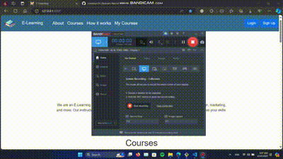
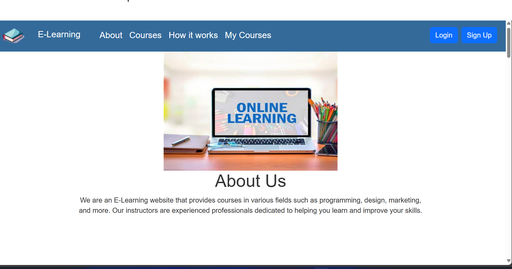
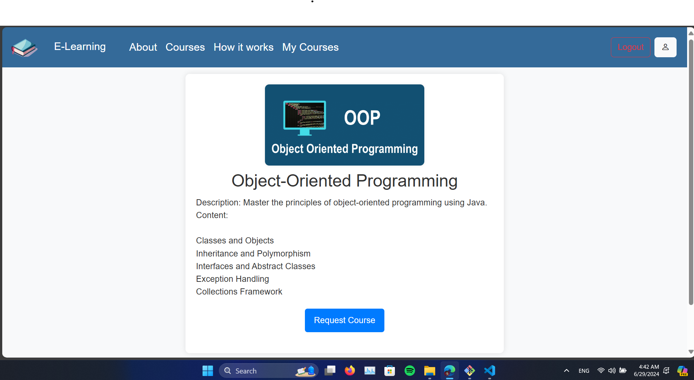
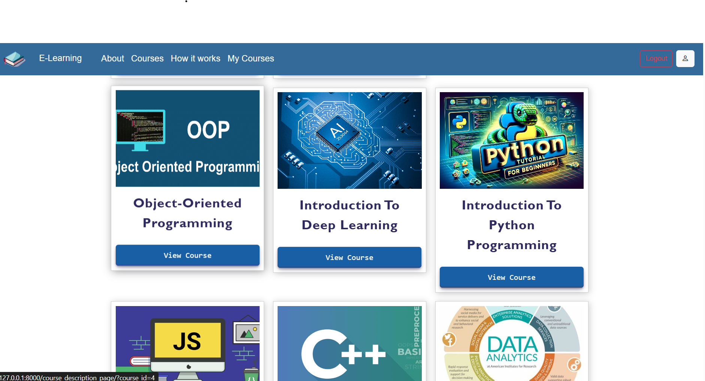
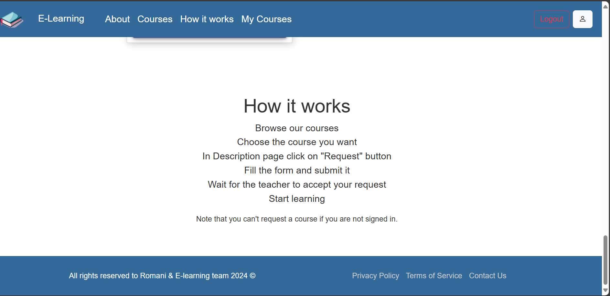
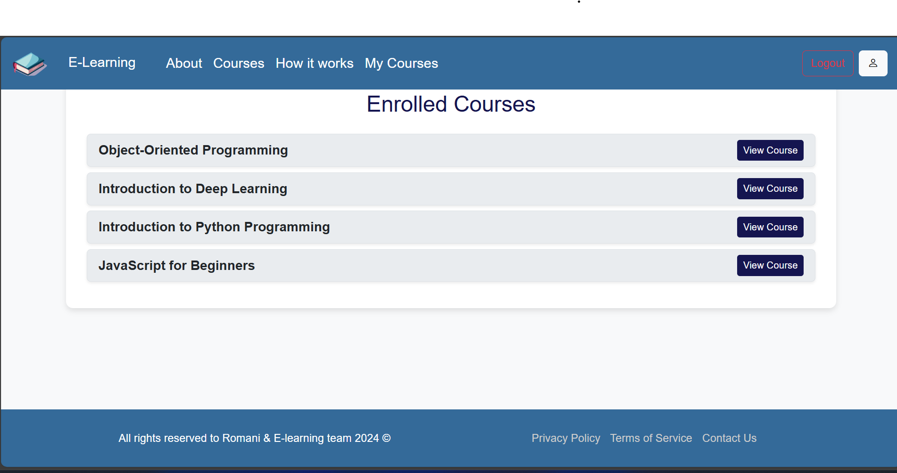
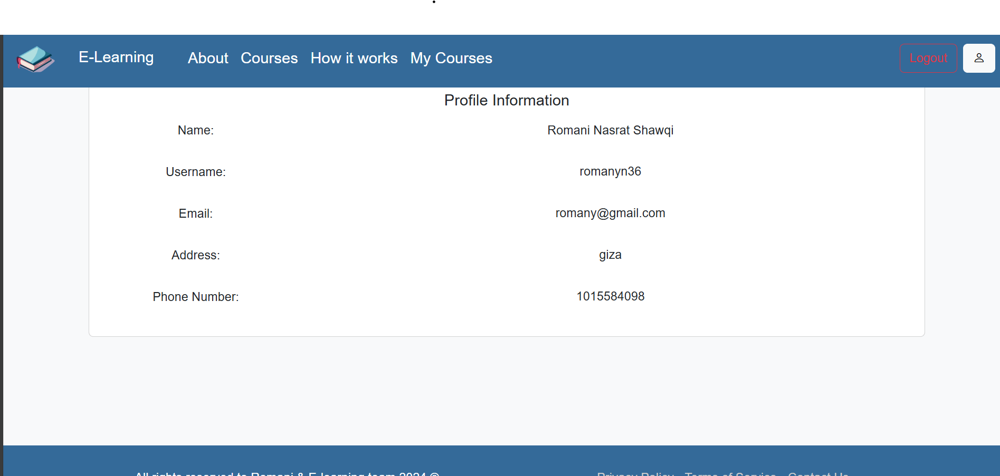
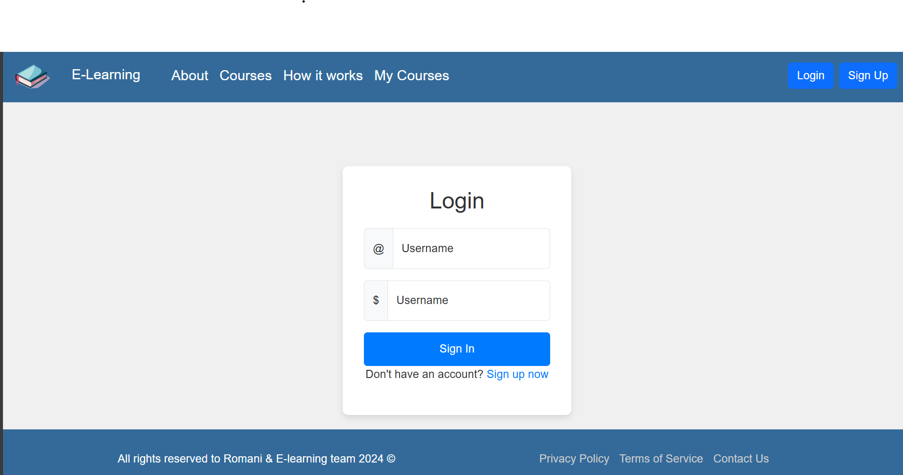
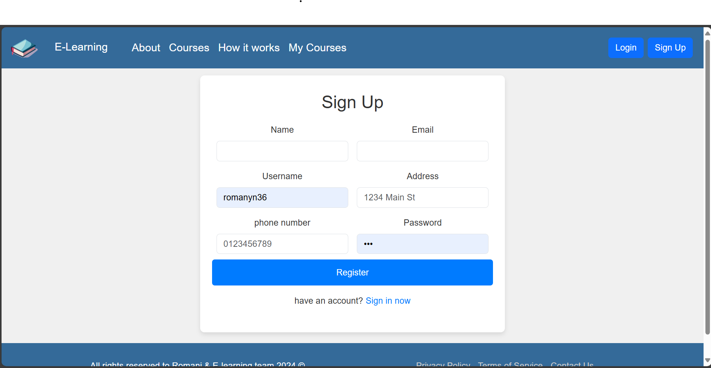

<div align="center" id="top"> 
  

  &#xa0;

  <!-- <a href="images/demo.gif">Demo</a> -->
</div>

<h1 align="center">E Learning Platform Using Django</h1>


<p align="center">
  

  

  

  

  

  
</p>


<p align="center">
  <a href="#dart-about">About</a> &#xa0; | &#xa0; 
  <a href="#sparkles-features">Features</a> &#xa0; | &#xa0;
  <a href="#rocket-technologies">Technologies</a> &#xa0; | &#xa0;
  <a href="#white_check_mark-requirements">Requirements</a> &#xa0; | &#xa0;
  <a href="#checkered_flag-starting">Starting</a> &#xa0; | &#xa0;
  <a href="#memo-license">License</a> &#xa0; | &#xa0;
  <a href="#heart-contact-me">Contact</a>

</p>
<!-- images -->
<div style="display: flex; justify-content: center;">
    
</div>

<div style="display: flex; justify-content: space-around; flex-wrap: wrap; margin-top: 20px;">
 
    
    
    
    
    
    
    
</div>


<br>

## :dart: About ##
this project is (backend) example on how to use Django to build an e-learning platform. we applied many django functionalities i mentioned below.
note: this project is not completed yet,and not front-end optimized, it just backend example.
<hr>
  This project is an e-learning platform that allows students to browse and apply for courses. ande manage courses and students using the Django admin panel. The project also includes a simple authentication system that allows students to sign up, log in, and log out. The project uses  RESTful API that allows students to browse and apply for courses. The project also uses JWT to authenticate and authorize students to access the API.

## :sparkles: Features ##

:heavy_check_mark: Register and login students;\
:heavy_check_mark: Browse and apply for courses;\
:heavy_check_mark: Manage courses and students using the Django admin panel;\
:heavy_check_mark: Authenticate and authorize students to access the API using JWT;\
:heavy_check_mark: RESTful API that allows students to browse and apply for courses;\
:heavy_check_mark: Responsive design using Bootstrap 5;\


## :rocket: Technologies ##

The following tools were used in this project:

- [Django](https://www.djangoproject.com/)
- [JWT](https://jwt.io/)
- [Bootstrap 5](https://getbootstrap.com/)

## :white_check_mark: Requirements ##

Before starting :checkered_flag:, you need to the requirements below:
```bash 
Pillow==10.0.1
PyJWT==1.7.1
Django==5.0.1
django-cors-headers==4.3.1
```

## :checkered_flag: Starting ##

```bash
# Clone this project
$ git clone https://github.com/romanyn36/e-learning-platform-using-django

# Access
$ cd e-learning-platform-using-django

# Install dependencies
$ pip install -r requirements.txt

# Run the project
$ python manage.py runserver

# The server will initialize in the <http://127.0.0.1:8000/>
```

## :memo: License ##

This project is under license from MIT. For more details, see the [LICENSE](LICENSE.md) file.

## :heart: contact me ##
Made with :heart: by Romani 
<p align="center">
 
<!-- icons  --><a href="https://github.com/romanyn36" target="blank"></a> <a href="https://linkedin.com/in/romanyn36" target="blank"></a> <a href="https://fb.com/romanyn3" target="blank"></a> <a href="https://twitter.com/romanyn36" target="blank"> <a href="https://stackoverflow.com/users/17348975/romani" target="blank"></a><a href="https://kaggle.com/romanyn36" target="blank"></a> <a href="https://www.instagram.com/romanyn36" target="blank"></a> <a href="https://www.leetcode.com/romanyn36" target="blank"></a> <a href="https://dev.to/romanyn36" target="blank"></a>

<!-- <a href="https://www.buymeacoffee.com/romanyn36" target="_blank" style="display: inline-block;">
    
  </a> -->
  
</p>

<a href="#top">Back to top</a>
